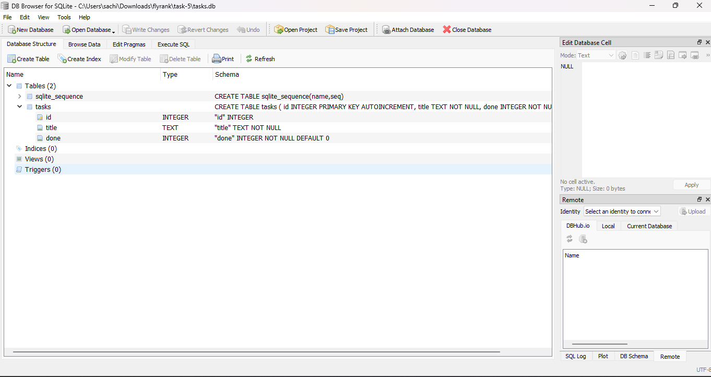

# Task API - SQLite Edition

A CRUD REST API for tasks, built with FastAPI and SQLite. This is the database-backed version of the Week 2 Assignment 1 API. The endpoints are identical; only the storage layer changed.

---

## Why SQLite

SQLite was chosen because it requires no installation and no separate server process. The entire database lives in a single file (`tasks.db`) on disk. For a learning project and a single-developer API this is the right tool: zero setup friction, real SQL, and data that survives restarts.

When a project grows to multiple concurrent writers or needs to run across servers, moving to PostgreSQL or MySQL is straightforward because the SQL queries stay almost the same.

---

## Where the database file is stored

`tasks.db` is created automatically in the same directory you run the server from. It is a standard SQLite file and can be opened with any SQLite viewer.

---

## How to start the project

Install dependencies:

```bash
pip install -r requirements.txt
```

Start the server:

```bash
uvicorn main:app --reload
```

The database and table are created automatically on first run. Three example tasks are inserted only if the table is empty.

Open the interactive docs: [http://localhost:8000/docs](http://localhost:8000/docs)

---

## Database schema

```sql
CREATE TABLE tasks (
    id    INTEGER PRIMARY KEY AUTOINCREMENT,
    title TEXT    NOT NULL,
    done  INTEGER NOT NULL DEFAULT 0
);
```

---

## API endpoints

| Method | Path | Description |
|--------|------|-------------|
| GET | /tasks | List all tasks (supports ?search= and ?done=) |
| GET | /tasks/{id} | Get a single task |
| POST | /tasks | Create a task (201 on success, 400 if title blank) |
| PUT | /tasks/{id} | Update title and/or done |
| DELETE | /tasks/{id} | Delete a task |
| GET | /stats | Task counts (total, completed, pending) |

---

## Example SQL queries

These were run manually in DB Browser for SQLite against `tasks.db`. See `queries.sql` for the full list.

```sql
-- All tasks
SELECT * FROM tasks;

-- Only completed
SELECT * FROM tasks WHERE done = 1;

-- Count
SELECT COUNT(*) FROM tasks;

-- Mark all done
UPDATE tasks SET done = 1;

-- Delete completed
DELETE FROM tasks WHERE done = 1;
```

---

## What changed from Assignment 1

The API surface is identical. The only change is the storage layer:

| Before | After |
|--------|-------|
| Python list in memory | SQLite file on disk |
| Data lost on restart | Data survives restart |
| No SQL | Full SQL queries |
| `next_id` counter | `AUTOINCREMENT` primary key |

---

## Screenshot


